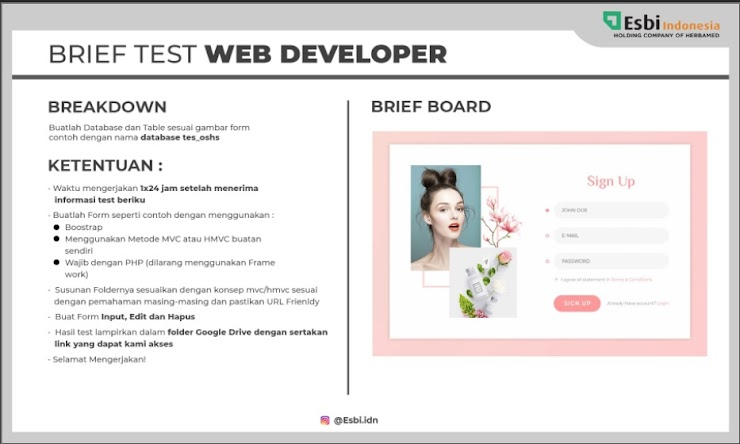

# Database Tes OSHS

Technical Test from PT Esbi Batara Niaga Indonesia

#### Requirement



#### Usage/Penggunaan Aplikasi

- extract file ```.rar``` atau ```.zip``` lalu masukan kedalam folder htdocs (XAMPP) atau www (Laragon)

- jalankan server lokal (XAMPP/Laragon) dan buka aplikasi di url [http://localhost/database-tes_oshs/](http://localhost/database-tes_oshs/)

- aplikasi memiliki 1 halaman yaitu halaman utama yang berisi form input (Sign Up) dan didalamnya juga terdapat fitur read (List User), edit (Edit User dengan menggunakan Modal), dan delete (Delete User).

- database menggunakan SQLite sehingga tidak memerlukan setup yang rumit untuk menjalankan aplikasi.
